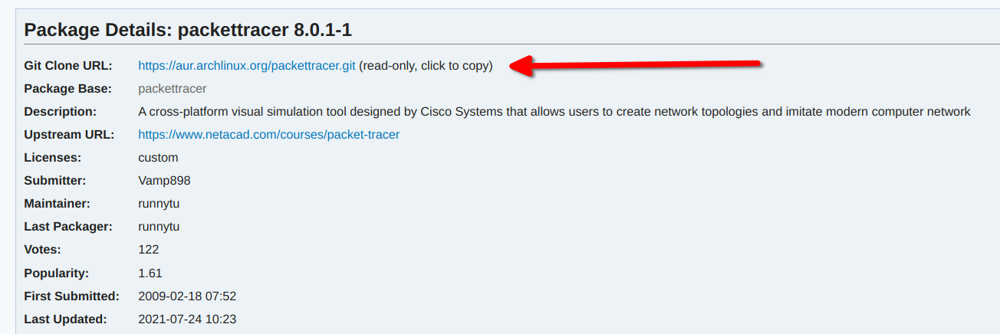

# Fixing Things

## Fixing microphone external input on Manjaro

Source yang saya gunanakan adalah:
- [Arch Wiki](https://wiki.archlinux.org/title/Advanced_Linux_Sound_Architecture#Correctly_detect_microphone_plugged_in_a_4-pin_3.5mm_(TRRS)_jack)
- [Nobody moving away from SE (superuser stackexchange)](https://superuser.com/questions/1312970/headset-microphone-not-detected-by-pulse-und-alsa#answer-1329331)

Sebelumnya, Install dulu `alsa-tools`:
```zsh
    $ sudo pacman -S alsa-tools
```
Atau kalau kurang mantep, install juga `alsa-utils`:
```zsh
$ sudo pacman -S alsa-utils
```
Tapi seharusnya `alsa-tools` aja udah cukup.

Setelah itu, seperti yang ada pada sumber diatas:
1. Masuk ke directory `/etc/modprobe.d`
2. Cek dengan `ls -a` apakah ada file yang bernama `alsa-base.conf`, jika belum ada maka langsung aja buat sendiri file nya
3. Masuk ke file `alsa-base.conf` tersebut dengan editor `vim` atau `nano`
4. Tambahkan baris baru:
    ```zsh
    options snd_hda_intel index=0 model=<nama-model>
    ```
5. `<nama-model>` diatas diganti dengan model yang sesuai dengan [HD-Audio Codec-Specific Models](https://www.kernel.org/doc/html/latest/sound/hd-audio/models.html#hd-audio-codec-specific-models)
6. Untuk mengetahui kira - kira model sound card (sound type atau apalah terminologi nya) bisa dengan command:
```
    $ cat /proc/asound/card*/codec* | grep Codec
```
7. Dalam kasus saya, saya menggunakan Acer Aspire:
   1. Output step-6:
        ```
        Codec: Realtek ALC256
        Codec: Intel Kabylake HDMI

        ```
   2. Sehingga pada yang harus saya cari adalah model `ALC256`. Dalam section [ALC22x/23x/25x/269/27x/28x/29x (and vendor-specific ALC3xxx models)](https://www.kernel.org/doc/html/latest/sound/hd-audio/models.html#alc22x-23x-25x-269-27x-28x-29x-and-vendor-specific-alc3xxx-models) terdapat model:
        ```md
        aspire-headset-mic
            Headset pin fixup for Acer Aspire
        ```
    3. Maka dari itu, yang saya tulis pada file `alsa-base.conf` adalah:
        ```zsh
        options snd_hda_intel index=0 model=aspire-headset-mic
        ```
8. Reboot komputer
9. Setelah komputer hidup kembali. Pasang headset yang mempunyai mic, kemudian masuk ke `System Settings > Audio`. Ganti *Port* pada *Recording Device* ke *Headset Microphone*.

## `.deb` file installation in Manjaro (Arch Linux based)

> Contoh dari instalasi nya saya gunakan adalah _Packet Tracer_. Sehingga, seharusnya langkah - langkah untuk menginstall `.deb` pada program/aplikasi lain akan cukup _mirip_ (Mungkin tidak 100% sama, tapi mirip).

Tata cara dan langkah - langkah penginstalan _packet tracer_ sudah ada di _Pinned Comments_ <https://aur.archlinux.org/packages/packettracer/>.

Secara urut saya copy-paste seperti berikut:

1. Download the snapshot from this AUR.
2. Tar -zxf the packettracer.tar.gz snapshot (it creates the dir packettracer/ with the PKGBUILD on it).
3. Download the latest packettracer tarball from your Netacad account and copy it into the packettracer/ dir.
4. Create the package with the command makepkg (it creates a packettracer.pkg.tar.xz).
5. Install the package with either makepkg -i or sudo pacman -U packettracer.pkg.tar.xz

> Langkah 2 diatas tidak perlu dilakukan jika mendownload nya dengan menggunakan `git clone` pada _AUR repository_ berikut 
>
> command: `git clone https://aur.archlinux.org/packettracer.git`

Ketika melakukan langkah ke-4, saya mendapatkan error (di line paling bawah):

```plain
Building packettracer...
==> Making package: packettracer 8.0.1-1 (Sen 02 Agu 2021 04:17:39 )
==> Checking runtime dependencies...
==> Checking buildtime dependencies...
==> Retrieving sources...
==> ERROR: CiscoPacketTracer_801_Ubuntu_64bit.deb was not found in the build directory and is not a URL.
Failed to build packettracer
```

Hal ini dikarenakan `PKGBUILD` dari AUR repository yang didownload di langkah 1 mencoba untuk menginstall CiscoPacketTracer versi 8.0.1, sedangkan yang saya masukkan ke `/packettracer` dir nya CiscoPacketTracer versi 8.0.0.

Saya coba lihat isi[^pkgbuild-pt] dari `PKGBUILD`, namun isinya terlalu verbose dan saya takut malah membuat machine saya bermasalah karena mengubah ubah `PKGBUILD` yang pada awalnya tidak sesuai dengan versi packettracer saya.

Solusi lainnya adalah dengan mengubah nama file yang sebenarnya `CiscoPacketTracer_800_Ubuntu_64bit.deb`, diubah ke `CiscoPacketTracer_801_Ubuntu_64bit.deb`. Namun, lagi, saya tidak mau kalau malah program/aplikasi nya bermasalah ketika dijalankan.

Solusi paling bagus adalah dengan mendownload `.deb` file packettracer dengan versi 8.0.1 (versi terbaru pada saat ini (2 juni 2021)). Kemudian dilakukan langkah 4 sampai selesai, dan ternyata berhasil.

> Pastikan nama dari `deb` file tersebut tidak terubah dari hasil download. Kadang kalo download dipercobaan kedua ada postfix "_(1)_" yang mana kemungkinan akan membuat langkah ke-4 gagal.

Hasil dari langkah ke-4 adalah file `packettracer-8.0.1-1-x86_64.pkg.tar.zst` yang mana berformat `pkg.tar.zst`, padahal di langkah ke-5 tertulis kalau formatnya `pkg.tar.xz`. Meskipun begitu, ketika saya gunakan command 

```plain
sudo pacman -U packettracer-8.0.1-1-x86_64.pkg.tar.zst
```

ternayata tetep **works!**.

## Deleting App that installed using `.run` file

Aplikasi yang ingin saya hapus adalah _packettracer_ versi _7.2.2_ yang mana sebelumnya saya install menggunakan `.run` file.

Langkah ini saya dapatkan dari <https://unix.stackexchange.com/questions/112077/uninstalling-run-file>.

Hasil dari `whereis packettracer` atau `which packettracer`:

```plain
/usr/local/bin/packettracer
```

Ternyata, lokasi diatas hanyalah _symlink_ mem-pointing ke direktori:

```plain
/opt/pt
```

Didalam _real_ directory tersebut terdapat file bernama `uninstall.sh` yang mana di-line pertama pada file tersebut terdapat command:

```bash
sudo rm -f /usr/local/bin/packettracer
```

yang mana menghapus simlink nya.

Dengan menjalankan program `uninstall.sh` tersebut dan menghapus `/opt/pt` direktori, maka kira kira kemungkinan besar semua program file hasil dari instalasi `.run` sudah terhapus.

## Footnote

[^pkgbuild-pt]: Isi `PKGBUILD` nya:
    ```plain
    # Maintainer: Runnytu < runnytu at gmail dot com >
    # OldMaintainer: Alexey Kharlamov <der@2-47.ru>
    # Contributor: David Dufberg Tøttrup <david at dufberg dot se>
    # Contributor: Jordi De Groof <jordi(dot)degroof(at)gmail(dot)com>
    # Contributor: pyther <pyther@pyther.net>
    # Contributor: z3ntu <WEI16416@spengergasse.at>

    pkgname=packettracer
    pkgver=8.0.1
    pkgrel=1
    pkgdesc="A cross-platform visual simulation tool designed by Cisco Systems that allows users to create network topologies and imitate modern computer network"
    arch=( 'x86_64' )
    depends=('openssl>=1.0' 'dbus' 'icu' 'glib2' 'libxml2' 'libjpeg-turbo' 'nss' 'libxss' 'java-runtime>=1.7.0')
    options=('!strip' '!emptydirs')
    url="https://www.netacad.com/courses/packet-tracer"
    license=('custom')

    source=('local://CiscoPacketTracer_801_Ubuntu_64bit.deb'
        'packettracer.sh')
    sha512sums=('541743d823b6bbe4ac86491fa2361d2de62761f4bbefe52c832706dff807c80342b4dbd5c9f8dbfebcda1a502cfe11257af98728053ccab20fefebfa7701309c'
            '3246843441207d66ccffd0717aa85a7bf828842c2c337d1527597bdf57cc2f9966c75c764aa22f9cb6a331e6268dd64af0da7ce4cc89725d418fc54e163230f2')

    package() {

        tar xf data.tar.xz -C "${pkgdir}"
        chown -R 0:0 ${pkgdir}
        mv ${pkgdir}/opt/pt/ ${pkgdir}/opt/packettracer/
        mkdir -p "${pkgdir}/usr/bin/"

        find "${pkgdir}" -type d -exec chmod 755 {} \;
        find "${pkgdir}/opt/packettracer/help/" -type d -exec chmod 777 {} \;
        find "${pkgdir}/opt/packettracer/saves/" -type d -exec chmod 555 {} \;
        find "${pkgdir}/opt/packettracer/art/html/network_controller/" -type d -exec chmod 775 {} \;
        find "${pkgdir}/opt/packettracer/art/RackView/CablePegboard/" -type d -exec chmod 775 {} \;
        find "${pkgdir}/opt/packettracer/bin/xcbglintegrations/" -type d -exec chmod 775 {} \;
        find "${pkgdir}/opt/packettracer/help/default/NetconRestAPI/" -type d -exec chmod 775 {} \;
        
        ln -s /opt/packettracer/packettracer "${pkgdir}/usr/bin/packettracer"

        ln -s /usr/lib/libdouble-conversion.so "${pkgdir}/opt/packettracer/bin/libdouble-conversion.so.1"

        sed -i 's|/opt/pt|/opt/packettracer|' "${pkgdir}/opt/packettracer/linguist" "${pkgdir}/opt/packettracer/packettracer" "${pkgdir}/usr/share/applications/cisco-pt.desktop" "${pkgdir}/usr/share/applications/cisco-ptsa.desktop"

        sed -i -e "\$aCategories=Network;" "${pkgdir}/usr/share/applications/cisco-pt.desktop" "${pkgdir}/usr/share/applications/cisco-ptsa.desktop"

        install -D -m755 "${srcdir}/packettracer.sh" "${pkgdir}/etc/profile.d/packettracer.sh"

        install -D -m644 "${pkgdir}/opt/packettracer/help/default/copyrights.htm" "${pkgdir}/usr/share/licenses/${pkgname}/COPYRIGHT"

    }
    ```