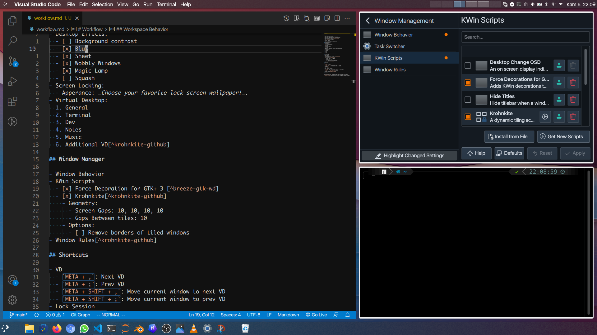
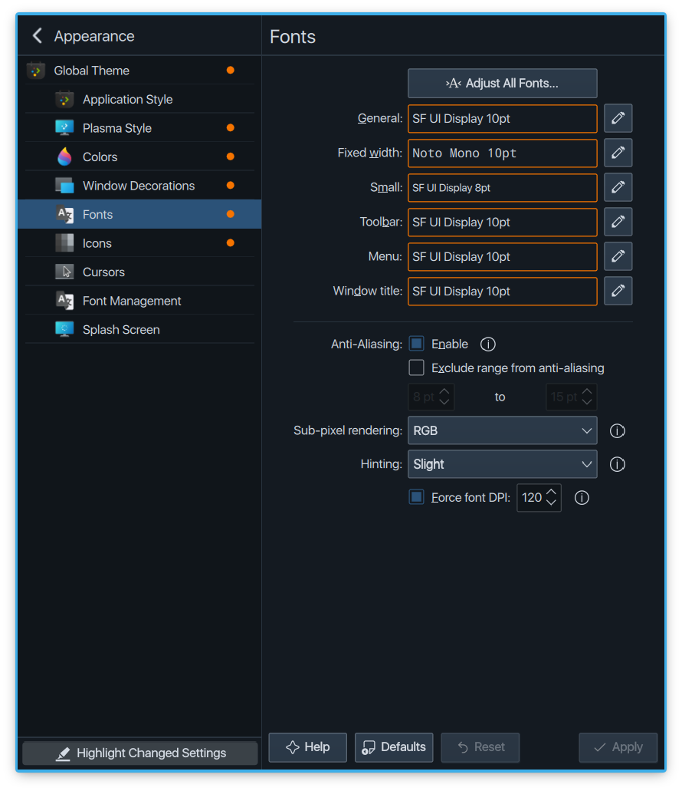

# Workflow 

> In this workflow, I often do not include the default setting in this workflow. So, if I don't mention it, do leave it as default.

## Fullscreen Manjaro

## Settings

### Apperance

- Global Theme: _Aritim-Dark_
- Application Style: _Breeze_ [^breeze-gtk-wd]
- Plasma Style: _Spectrum Classic Dark HiDPI display_
- Colors: _Aritim opaque_
- Window decoration: _Breeze_[^krohnkite-github]
- Fonts: 
- Icons: Papirus -> WhiteSur (Ligth/Dark) -> Win11 (Ligth/Dark).
- Cursors: _Breeze_
- Splash Screen: _BeautifulTreeAnimation_

### Workspace Behavior

- Desktop Effects:
  - [ ] Background contrast
  - [x] Blur
  - [x] Sheet
  - [x] Wobbly Windows
  - [x] Magic Lamp
  - [ ] Squash
- Screen Locking:
  - Apperance: _Choose your favorite lock screen wallpaper!_.
- Virtual Desktop:
  1. General
  2. Terminal
  3. Dev
  4. Notes
  5. Music
  6. Additional VD[^krohnkite-github]

### Window Manager

- Window Behavior
- KWin Scripts
  - [x] Force Decoration for GTK+ 3 [^breeze-gtk-wd]
  - [x] Krohnkite[^krohnkite-github]
    - Geometry:
      - Screen Gaps: 10, 10, 10, 10
      - Gaps Between tiles: 10
    - Options:
      - [ ] Remove borders of tiled windows
- Window Rules[^krohnkite-github]

### Shortcuts

- VD
  - `META + ,`: Next VD
  - `META + ;`: Prev VD
  - `META + SHIFT + ,`: Move current window to next VD
  - `META + SHIFT + ;`: Move current window to prev VD
- Lock Session
  - [ ] `META + L`
  - [x] `CTRL + ALT + L`
- Close, Maximize, Minimize
  - `CTR + Q`: Quit
  - `ALT + Q`: Close (Better use this shortcut to close window)
  - `META + W` or `META + ALT + UP`: Maximize
  - `META + ALT + DOWN`: Minimize
- Khronkite Shorcut[^krohnkite-github]

## Terminal

- [x] _zsh_ (framework: _oh-my-zsh_)
- [x] _vim_ (framework: _vimrc_) and _leafpad_.

## Development

For development, I use _VS-Code_ (Not _VS-Code-OSS_) with [this](../ide-conf/config.md) configurations.

## Footnotes

[^breeze-gtk-wd]: Author app ini menyaraknkan agar memakai Breeze-GTK untuk _Application Style_ nya. Bisa dilihat pada: <https://store.kde.org/p/1235093/>
[^krohnkite-github]: Semua dokumentasi, instalasi, konfigurasi, ada pada: <https://github.com/esjeon/krohnkite>